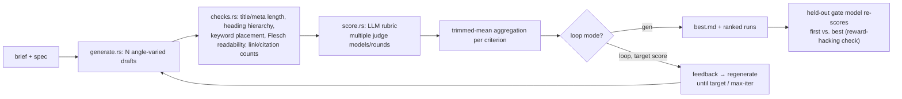
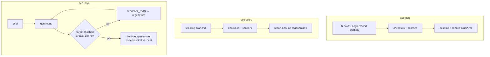
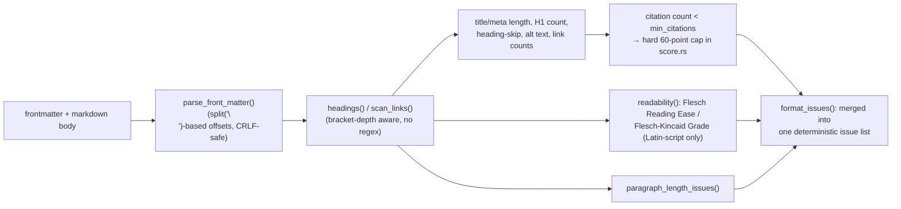

# seo-loop

A Rust CLI for SEO content (blog posts/landing-page copy): **generate N drafts → deterministic rule checks → LLM rubric scoring → feedback-driven regeneration**.
LLM backend is the Claude Code CLI (`claude -p`) as a subprocess — no separate API key required.

Ports the same "generate N → rule-check → de-anchoring rubric score → regenerate" architecture as [Loop-Suite/bizplan-loop](https://github.com/Loop-Suite/bizplan-loop) (a business-plan generation tool) into SEO copy generation.

## How this differs from the `seo-reference-library` skill

This CLI is **complementary, not overlapping**, with the `seo-reference-library` Claude Code skill some users already have. `seo-reference-library` is an **evidence-based audit** tool — it measures an existing site and produces SEO design patterns/checklists/scores; it diagnoses a page that already exists. `seo-loop`, on the other hand, **generates new content** and scores/regenerates it toward a target score in a loop — it produces a piece of writing that doesn't exist yet. Use `seo-reference-library` when you need an audit, and `seo-loop` when you need a new blog-post/landing-page copy draft. You can use them together: move the checklist that `seo-reference-library` produced into `specs/*.toml`'s `guide`/`context` fields to strengthen the scoring criteria.

## Pipeline

### Overview



### CLI modes



### Deterministic checks detail



## Requirements

- Rust 1.70+
- `claude` CLI installed and logged in (use `--claude-bin` if not on PATH)

## Build

```bash
cargo build --release   # target/release/seo
```

## Three modes

```bash
# 1) generate N drafts + score + rank
seo --model sonnet --judge-model haiku \
  gen --spec specs/example-blogpost.toml --brief brief.example.md -n 6 --rounds 2 --concurrency 3 --out runs/blog

# 2) score an existing draft only
seo --judge-model sonnet,haiku \
  score --spec specs/example-blogpost.toml --input draft.md --rounds 3 --out runs/check

# 3) self-improvement loop toward a target score (+ held-out check)
seo --model opus --judge-model sonnet --gate-model haiku \
  loop --spec specs/example-blogpost.toml --brief brief.example.md --target 85 --max-iter 4 --out runs/loop
```

## Backend behavior

The invocation always takes this shape (verified against `claude --help`).

```
claude -p --output-format json --safe-mode --no-session-persistence --tools "" \
       [--model M] [--append-system-prompt S] [--json-schema SCHEMA] [--max-budget-usd X]
```

| Flag | Reason |
|---|---|
| `--safe-mode` | Don't load the working directory's CLAUDE.md/skills/plugins/hooks/MCP → reproducibility. Disable with `--load-context` |
| `--tools ""` | Fully disables built-in tools (Read/Edit/Write/Bash) → pure text generation, no file access |
| `--no-session-persistence` | No session file written. Avoids contention under parallel execution |
| `--json-schema` | Forces the scoring result into a schema. A validated object arrives in the response's `structured_output` |
| `--output-format json` | Collects `result` / `structured_output` / `total_cost_usd`, printed as a running total at the end |

`--bare` is not used — it doesn't read OAuth/keychain and only accepts `ANTHROPIC_API_KEY`, which breaks auth for subscription-login users.

The prompt is passed over stdin; writing stdin and reading stdout/stderr happen on separate threads simultaneously (to avoid deadlock from a saturated pipe buffer).

## Document format

The document being generated/scored is frontmatter plus Markdown.

```markdown
---
title: "title, 50-60 characters"
meta_description: "meta description, 120-160 characters"
---

# H1 (exactly one)

Body... ## subheading ...
```

## Scoring

1. **Deterministic checks** (`checks.rs`, Rust, no LLM):
   - title/meta_description character-count range
   - Exactly one H1, no heading-level skipping (e.g. H1→H3 forbidden)
   - Whether the target keyword is **present** in the title / H1 / first 100 characters of the intro (presence, not density — the SEO industry has no agreed-upon density threshold, so this project doesn't enforce an arbitrary percentage)
   - Whether image alt text is present
   - Whether the internal-link count falls within the spec's configured range (default 3–5) — **this range varies a lot by site structure and article length.** It's not an absolute standard, just a per-site reference value to tune in the spec file.
   - Source/citation (external authoritative link) count — for E-E-A-T. A criterion marked `citation_required = true` gets a **hard 60-point cap in code** if citations fall below `min_citations` (see below)
   - (secondary signal) Flesch Reading Ease / Flesch-Kincaid Grade — computed only for Latin-script content (see limitations below)
2. **LLM rubric scoring**: **0–100** per criterion, default 4 criteria (weights tunable in `specs/*.toml`):
   - `search_intent_match` 0.30 — fit with search intent
   - `keyword_naturalness` 0.20 — natural keyword usage (avoiding over-optimization)
   - `eeat_signals` 0.25 — experience/expertise/authoritativeness/trustworthiness signals, `citation_required = true`
   - `structure_readability` 0.25 — heading hierarchy, paragraph structure, scannability

   Before scoring, the model must first write out "what conditions content needs to meet to rank for this search intent" (de-anchoring), and for every criterion it must **quote the document verbatim** and explain **"why not a higher score."** No quoted evidence caps the score at 60 (a general rule for content scoring, per the prompt).
3. **Citation-shortfall 60-point cap (enforced in code)**: for a criterion like `eeat_signals` with `citation_required = true`, since the source/citation link count is deterministically countable — unlike bizplan-loop, which leaves this entirely to the LLM prompt — `score.rs` applies a **hard 60-point cap directly** based on the measured count. Shown in the report with a 🔒60 marker.
4. **Aggregation**: `--rounds N` rounds → cycling models/lenses → **trimmed mean** per criterion (n≥4 drops min & max) → weighted sum.
5. **Instability signal**: per-criterion score spread (±) is shown in the report. Don't trust a criterion with a wide spread.
6. **Held-out gate** (`--gate-model`): a model that never participated in the loop re-scores only the first and best drafts. If the loop score rose but the held-out score didn't, it's flagged as scorer optimization (reward hacking).

For de-anchoring, trimmed mean, held-out gate, length canary, and why a `--judge-model` panel is preferred over just increasing `--rounds` — with primary sources (arXiv papers, etc.) — see [bizplan-loop's DESIGN.md](https://github.com/Loop-Suite/bizplan-loop/blob/main/DESIGN.md).

## Open-source attribution

- **[BlogPilot Open Source AI SEO Content Studio](https://github.com/IamRamgarhia/BlogPilot-Open-Source-AI-SEO-Content-Studio)** (MIT): `src/checks.rs` ports the Flesch Reading Ease / Flesch-Kincaid Grade calculation logic from `src/lib/seo/readability.ts` (Markdown stripping → sentence/word splitting → syllable-count estimation → standard formula), rewritten in Rust. The algorithm structure was ported, not the code itself — see [NOTICE](NOTICE) for details.
  The same repo's E-E-A-T checklist (`eeat-checklist.md`) is a methodology document, not code, so it was only used as an idea reference (reflected in the citation-link check and rubric wording).
  The same repo's TF-IDF keyword extraction (`tfidf.ts`) was **not ported** — it needs a corpus of top-ranking competitor documents, and this CLI is a single-document generation/scoring tool with no such corpus.
- `sour4bh/auto-seo` (no declared license, all rights reserved) — its code was not consulted at all. Only the general idea of "hybrid rule + LLM scoring" (not copyrightable) served as a general reference when designing this project's deterministic-check + LLM-rubric structure.
- Yoast SEO (wordpress-seo, GPL-2.0) — its source was neither read nor referenced. Title/meta length, exactly-one-H1, heading hierarchy, etc. are widely known SEO-industry facts and were implemented independently.
- **CyberCraftBD/power-seo** (MIT) — the idea for `paragraph_length_issues()` (flagging overly long paragraphs) came from this repo's `paragraph-length.ts`. The original thresholds are English word-count based (120–150); this project redesigned it around Korean character count (600 chars) instead, since it also handles non-English content — neither the code nor the original threshold was copied as-is. See [NOTICE](NOTICE).

## Spec (`specs/*.toml`)

```toml
name = "Blog post"
context = "Site/brand/target-audience context. Inserted verbatim into the prompt"
keyword = "target keyword"
site_domain = "example.com"   # basis for internal/external link classification

title_min = 50
title_max = 60
meta_min = 120
meta_max = 160
internal_links_min = 3
internal_links_max = 5
min_citations = 1

[[criteria]]
id = "eeat_signals"
name = "E-E-A-T signals"
weight = 0.25
guide = "..."
citation_required = true   # 60-point cap if citations are insufficient
```

Bundled spec: `specs/example-blogpost.toml`. Example content brief: `brief.example.md`.

## Limitations & assumptions

- **Keyword density is not checked.** Only presence (title/H1/intro) is checked — density thresholds have no industry consensus, so enforcing an arbitrary percentage could actively encourage bad optimization.
- **The 3–5 internal-link range varies a lot by source.** Tune `internal_links_min/max` per site in the spec file.
- **The Flesch readability metric is English-only.** The Flesch formula is based on English syllable counting and doesn't hold for Korean and other non-Latin-script content. If the body's Latin-character share is under 50%, the calculation is skipped automatically and shown as N/A in the report (an arbitrary judgment call — other thresholds are possible, 50% was chosen conservatively).
- Internal/citation link classification is a simple heuristic based on whether the URL's host matches `site_domain` — subdomains, shortened URLs, etc. can still be misclassified in edge cases.
- LLM scores do not guarantee actual search ranking or click-through rate. Intended for **relative comparison** and **direction for improvement** within the same spec and scoring model.
- If the generation and scoring models are the same, it tends to rate its own style generously (a warning is printed if `--judge-model` isn't set).
- `claude -p` doesn't expose temperature → draft diversity comes only from angle prompts.
- Output is Markdown (including frontmatter). Converting it to an actual CMS's publish format is out of scope.

## 리서치 기반 개선 반영 (2026-08-01)

`docs/research-and-evidence-survey-2026-08-01.md` §5 백로그 중 다음을 구현했다.

- **다축 reward-hacking canary 추가** (`loop_run.rs`): 기존 길이 인플레이션 canary(분량 +25%인데 점수 +5 미만)는 arXiv:2605.27996("Reward Bias Substitution")이 경고하는 "단일 축 방어"에 해당한다. 이 논문의 핵심 주장 — 편향 축 하나(길이)만 막으면 최적화 압력이 관측되지 않는 다른 축으로 옮겨간다 — 을 근거로, 회차 간 타깃 키워드 등장 횟수(`Metrics::keyword_occurrences`)가 +50% 이상 급증했는데 점수 상승폭이 미미한(+5점 미만) 경우를 감시하는 키워드 밀도 canary를 추가했다. "저품질 인용 링크로 개수만 채우기" 축 대신 이 축을 고른 이유: `checks.rs`에 이미 있는 `norm_kw` 정규화 로직을 재사용할 수 있어 구현이 더 깔끔하고, 링크 품질 판정은 URL을 실제로 fetch해야 해서 아래 "스킵" 항목과 같은 이유로 제외했다.
- **한국어 가독성 휴리스틱 opt-in 추가** (`checks.rs::korean_readability`, `Metrics::korean_readability_heuristic`): 라틴 문자 비중이 50% 이상이면(Flesch가 계산되는 조건) 계산하지 않는 상호배타 필드로 추가했다. 공식은 `naaaayeonn/AI-literacy-care-Agent`(Python, 문서 `READABILITY_FORMULA.md`)를 참고했으나 코드는 포팅하지 않고 공식만 Rust로 재작성했다: `100 - (평균 어절수/문장 × 1.015) - (평균 음절수/어절 × 8.0) - (전문용어비율 × 35.0)`. **이 공식의 계수는 원 출처 스스로 동료검토된 학술적 근거가 없다고 명시한 경험적 휴리스틱**이므로 Flesch(표준 공식)와 별도 필드로 분리하고, 리포트에는 항상 "⚠️ 검증되지 않은 휴리스틱" 표기를 붙인다.
- **`score_doc` 라운드 병렬화** (`score.rs`): 문서 1건 채점 시 라운드마다 순차 호출하던 것을, `main.rs::par_map`이 문서 간 병렬화에 쓰는 `std::thread::scope` 패턴을 그대로 라운드 단위에 적용해 병렬화했다. `--concurrency`는 이미 문서 단위 예산이므로 별도 옵션 없이 라운드 수만큼만 스레드를 스폰하는 단순 구현으로 제한했다. 결과는 라운드 인덱스 순서를 유지해 반환하므로 `trimmed_mean` 등 집계 로직은 영향받지 않는다.

다음 두 항목은 리서치 문서가 명시적으로 보류를 결론 낸 항목이라 구현하지 않았다.

- **`pulldown-cmark` 도입**: §3.3이 "현재는 불필요, reference-style 링크·코드스팬 내 `]`·오토링크 버그가 실제로 나오면 그때 재검토"로 조건부 보류를 명시했다. 트리거 조건 미충족 상태라 구현하지 않았다.
- **인용 URL 실제 fetch 검증(FacTool류)**: §5가 "오프라인/재현성 우선 철학과 상충, 아이디어 단계"로 명시했다. 네트워크 의존성을 추가하는 자체가 이 CLI의 설계 철학과 맞지 않아 구현하지 않았다.

## Multi-lens review findings applied

Findings CONFIRMED by a review-panel pass (functionality/good_things/tests lenses) were applied:
- Fixed a real bug where the frontmatter parser under-counted by 1 byte per line on CRLF documents, truncating the start of the body (rewritten around `split('\n')`-based offset calculation instead of `.lines()`).
- Frontmatter with no closing `---` is now explicitly detected and flagged (previously it silently fell back to treating the whole document as body, corrupting readability/heading checks).
- Fixed `is_internal_url`, which used substring matching and could misclassify hosts like `notexample.com`/`example.com.evil.com` as internal links, to compare the host exactly instead.
- Added a paragraph-length check (idea from CyberCraftBD/power-seo, MIT, redesigned around Korean character count — see NOTICE).
- `scan_links()` now tracks bracket depth to handle a nested `[a[b]c](url)` label correctly and ignores escaped `\[`/`\]`.
- Broadened test coverage: CRLF frontmatter, unclosed frontmatter, host-spoofing rejection, the Korean-readability-returns-None branch, whitespace-only alt text, nested/escaped brackets, and more.
