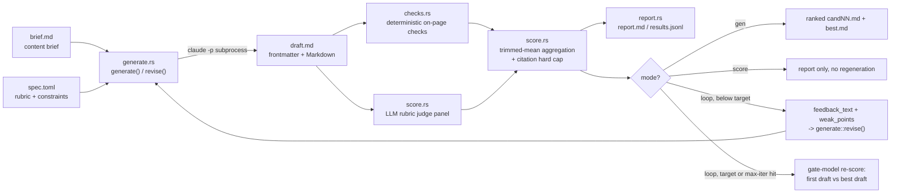
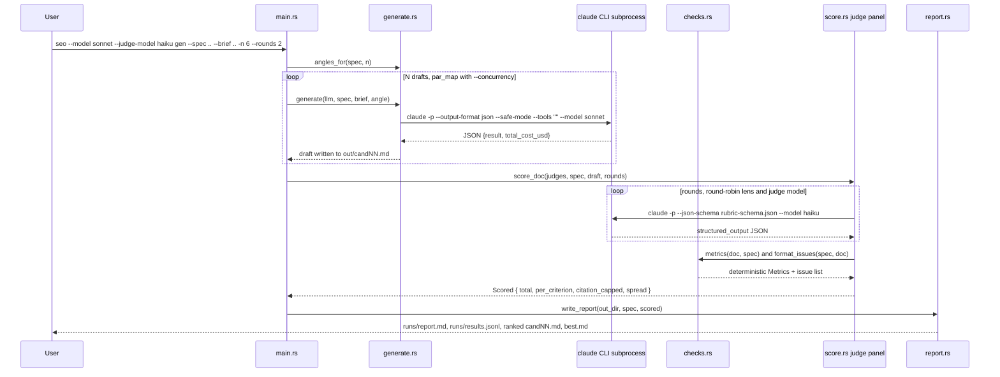
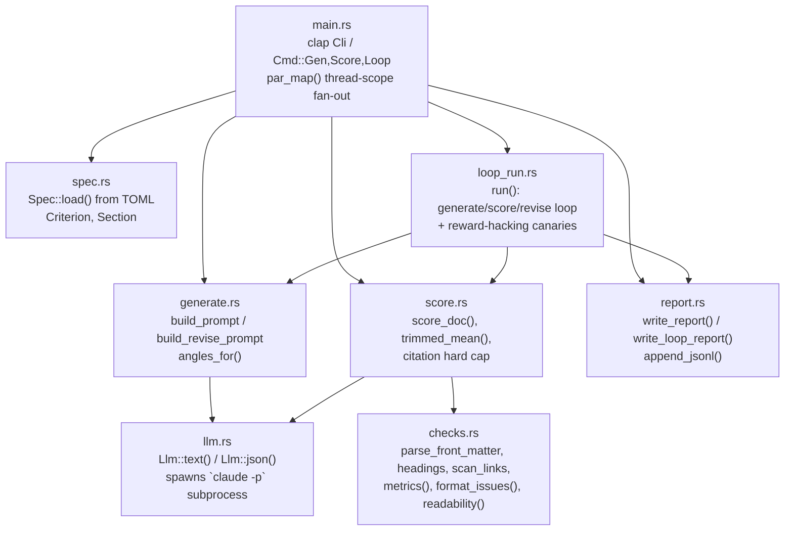
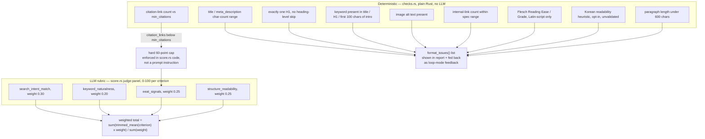
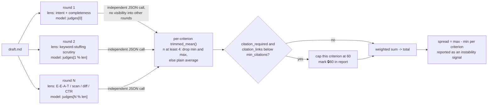
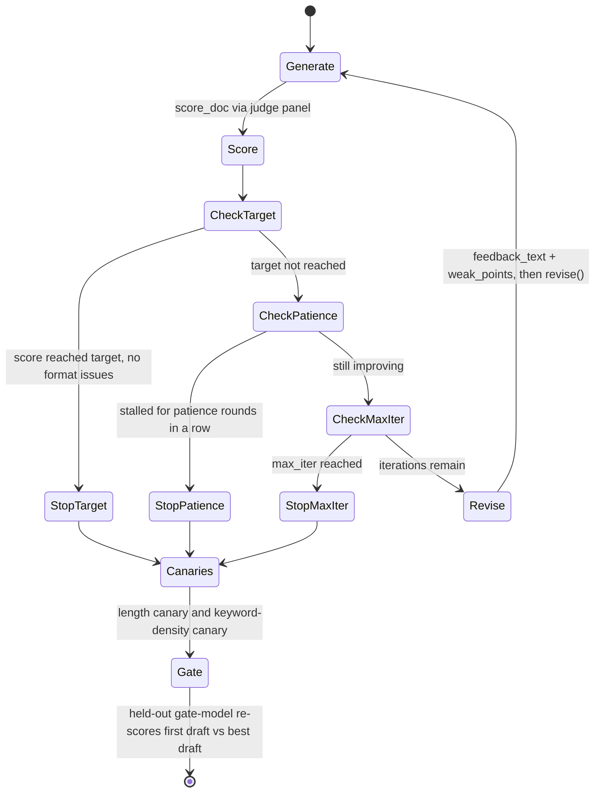

# seo-loop

A Rust CLI that generates SEO content (blog posts, landing-page copy) with an LLM, checks it against deterministic on-page rules, scores it with an LLM rubric panel, and — optionally — regenerates it in a closed loop toward a target score.

It uses the **Claude Code CLI** (`claude -p`) as a subprocess for every LLM call, so it needs no separate API key — it authenticates however `claude` already does on your machine (subscription login or API key).

The architecture ports the same "generate N → deterministic checks → de-anchored rubric score → regenerate" pattern used by [Loop-Suite/bizplan-loop](https://github.com/Loop-Suite/bizplan-loop) (a business-plan generator) into SEO copywriting. Primary sources for the scoring methodology (de-anchoring, trimmed-mean aggregation, held-out gate models, length canaries) live in that repo's `DESIGN.md`; this README documents how the same ideas are implemented here, plus two things bizplan-loop doesn't have: a deterministic citation-count hard cap and multi-axis reward-hacking canaries.

## Relationship to the `seo-reference-library` skill

`seo-loop` is complementary to, not a replacement for, the `seo-reference-library` Claude Code skill: that skill **audits a page that already exists** (evidence-based measurement → design patterns/checklists/scores). `seo-loop` **writes a page that doesn't exist yet** and scores/regenerates it toward a target. A natural combination: run `seo-reference-library` on a competitor or your own site, then paste the resulting checklist into a `specs/*.toml` file's `guide`/`context` fields to sharpen `seo-loop`'s rubric.

## Pipeline overview



## Three CLI modes

The binary is `seo` (built from `src/main.rs`, `Cargo.toml`'s `[[bin]] name = "seo"`).

```bash
cargo build --release   # -> target/release/seo
```

```bash
# 1) generate N drafts, check + score, rank them
seo --model sonnet --judge-model haiku \
  gen --spec specs/example-blogpost.toml --brief brief.example.md \
  -n 6 --rounds 2 --concurrency 3 --out runs/blog

# 2) score an existing draft only, no generation
seo --judge-model sonnet,haiku \
  score --spec specs/example-blogpost.toml --input draft.md --rounds 3 --out runs/check

# 3) self-improvement loop toward a target score, with a held-out sanity check
seo --model opus --judge-model sonnet --gate-model haiku \
  loop --spec specs/example-blogpost.toml --brief brief.example.md \
  --target 85 --max-iter 4 --out runs/loop
```

Global flags (apply to all three subcommands, defined once on `Cli` in `main.rs`):

| Flag | Default | Meaning |
|---|---|---|
| `--claude-bin` | `claude` | path to the Claude Code executable |
| `--model` | none | generation model (`opus`/`sonnet`/`haiku`/`fable` or a full model ID) |
| `--judge-model` | none | scoring model(s); comma-separated list rotates as a panel (e.g. `sonnet,haiku`) |
| `--retries` | `2` | retries per LLM call |
| `--timeout-secs` | `600` | timeout per LLM call |
| `--max-budget-usd` | none | forwarded to `claude --max-budget-usd` |
| `--load-context` | off | load the working directory's CLAUDE.md/skills/plugins/hooks (default is `--safe-mode`, which blocks this) |
| `--verbose` | off | print retry/failure logs |

If `--judge-model` is omitted, the CLI prints a warning and reuses `--model` for scoring — same-model self-scoring skews generous.

### `gen`

| Flag | Default | Meaning |
|---|---|---|
| `--spec` | required | path to `specs/*.toml` |
| `--brief` | required | content brief file (md/txt) |
| `-n, --count` | `3` | number of angle-varied drafts |
| `--out` | `runs` | output directory |
| `--rounds` (alias `--judges`) | `2` | scoring rounds per document |
| `--concurrency` | `1` | parallel documents in flight |
| `--no-score` | off | generate only, skip scoring |

### `score`

| Flag | Default | Meaning |
|---|---|---|
| `--spec` | required | path to `specs/*.toml` |
| `--input` | required | a single file or a directory of `*.md`/`*.txt` |
| `--out` | `runs` | output directory |
| `--rounds` (alias `--judges`) | `2` | scoring rounds per document |
| `--concurrency` | `1` | parallel documents in flight |

### `loop`

| Flag | Default | Meaning |
|---|---|---|
| `--spec` / `--brief` | required | same as `gen` |
| `--out` | `runs` | output directory |
| `--target` | `85.0` | target total score (0-100); loop stops early once reached |
| `--max-iter` | `4` | max iterations (most gains happen in the first 1-2 rounds per the cited literature) |
| `--rounds` (alias `--judges`) | `2` | scoring rounds per iteration |
| `--min-delta` | `2.0` | improvement below this counts as stalled |
| `--patience` | `2` | consecutive stalls before early stop |
| `--angle` | spec default | starting content angle |
| `--gate-model` | none | model that never scores inside the loop; re-scores only the first and best drafts afterward |

## CLI execution flow (`seo gen`)



## Module map



## Backend: how it drives the `claude` CLI

Every LLM call in `llm.rs` shells out with this shape (comments in the source say it was verified against `claude --help`):

```
claude -p --output-format json --safe-mode --no-session-persistence --tools "" \
       [--model M] [--append-system-prompt S] [--json-schema SCHEMA] [--max-budget-usd X]
```

| Flag | Reason |
|---|---|
| `--safe-mode` | Skip the working directory's CLAUDE.md/skills/plugins/hooks/MCP for reproducibility (drop it with `--load-context`) |
| `--tools ""` | Disables all built-in tools (Read/Edit/Write/Bash) — pure text generation, no file access |
| `--no-session-persistence` | No session file written, avoiding contention under `--concurrency > 1` |
| `--json-schema` | Forces the scoring reply into a schema; the validated object comes back as `structured_output` |
| `--output-format json` | Lets the CLI read `result` / `structured_output` / `total_cost_usd` (accumulated and printed at the end) |

`--bare` is deliberately not used: it only reads `ANTHROPIC_API_KEY` and skips OAuth/keychain, which breaks auth for subscription-login users.

Prompt goes over stdin; a separate thread writes stdin while others read stdout/stderr concurrently, to avoid a deadlock if the pipe buffer fills before the child process starts draining it.

If the JSON reply's `structured_output` is missing, `llm::extract_json()` falls back to pulling a JSON object out of the raw text (handles a stray code fence or trailing commentary).

## Deterministic checks vs. LLM judgment



The rubric prompt (`score.rs::build_judge_prompt`) explicitly tells the judge model to ignore title/meta length, heading hierarchy, link counts, and alt text — those are covered deterministically — and to score only content quality and persuasiveness.

## Judge panel: independent scoring, not a debate

`score_doc()` runs `--rounds` calls, each pinned to `judges[i % judges.len()]` (round-robin across `--judge-model`) and to `LENSES[i % LENSES.len()]` (six fixed personas: intent/completeness, keyword-stuffing scrutiny, E-E-A-T/citations, 3-10-second scan readability, competitive differentiation, on-page CTR contribution). Before scoring, each call must first write `winning_conditions` — what a top-ranking page for this intent would need — *before* seeing the rubric applied to the document, to reduce anchoring on the specific draft. Every criterion score also requires a verbatim quote (`evidence`) and a `why_not_higher` justification; no quote caps that criterion at 60.

Worth being precise about: **there is no cross-judge discourse here.** Each round is an independent JSON call with no visibility into any other round's verdict — the source comments in `score.rs` note explicitly that repeating the *same* model doesn't produce independent samples (correlated error), and that real independence comes from mixing different models in `--judge-model`. The only aggregation is statistical (trimmed mean, spread) plus, in `loop` mode, a separate held-out gate model that never participates in the loop at all.



## Loop mode: regeneration, reward-hacking canaries, held-out gate



`loop_run::run()` returns the **best-scoring iteration**, not the last one. Two canaries run once the loop stops:

- **Length canary**: if character count grew more than 25% between the first and best drafts while the score gained under 5 points, it warns that the gain may be padding rather than substance.
- **Keyword-density canary**: if `keyword_occurrences` (from `checks::metrics`) grew more than 50% while the score gained under 5 points, it warns of possible keyword stuffing. The source comments cite this as a second reward-hacking axis alongside length, referencing the repo's internal research notes (`docs/research-and-evidence-survey-2026-08-01.md`, §3.4) on why guarding a single axis lets optimization pressure shift to an unguarded one.

If `--gate-model` is set, a model that never scored inside the loop re-scores only the first and best drafts after the loop ends. `report.rs` flags it when the held-out score delta is under a third of the in-loop delta — a sign the loop score rose by pleasing the loop's own judges rather than by genuine improvement.

Regeneration prompts (`generate::build_revise_prompt`) never pass the numeric score back to the model — only `improvements` (concrete edit instructions) and the two weakest criteria by name — to avoid giving the model a number to directly optimize against. They also cap length drift explicitly ("keep total length within ±15% of the current draft").

## Document format

The artifact being generated or scored is YAML-ish frontmatter plus Markdown, parsed by `checks::parse_front_matter` (CRLF-safe, byte-offset based on `split('\n')` rather than `.lines()`):

```markdown
---
title: "50-60 character title"
meta_description: "120-160 character meta description"
---

# Exactly one H1

Body content. Target keyword must appear in title, H1, and the first 100
characters of the intro. Internal links use `[text](/path)`, citation/source
links use `[text](https://...)`. Images need non-empty alt text:
``.
```

## Content brief

`brief.example.md` is the bundled example a real brief follows — free-form Markdown with a few conventional sections (product/brand, target audience, key differentiators, and a "confirmed facts only, do not invent" section that explicitly lists claims the writer must *not* make):

```markdown
# Brand / Product
UrbanRun — cushioned running shoes for beginner runners. Sold through our own DTC online store, priced $80-120.

# Target Reader
People in their 20s-30s who just started running. Searching "best running shoes" and comparing options.

# Key Differentiators
- Midsole rebound resilience (measured): 62% (in-house testing; competitor average 55%)
- Fit: comfortable even for wide feet (accommodates D-E width)
- Free 30-day trial period with returns

# Confirmed Facts Only (do not invent)
- No marathon-certified track record yet — do not use phrases like "race-proven"
- Only 3 colors released (black/gray/white)
```

This entire file is inserted verbatim into the generation prompt (`generate::build_prompt`); the CLI itself is language-agnostic (the readability checks and prompts happen to be tuned with Korean content in mind, but nothing in `main.rs`/`spec.rs` requires it).

## Spec (`specs/*.toml`)

Bundled example: `specs/example-blogpost.toml`. A spec defines the target keyword, length/link constraints, optional recommended H2 outline, content angles, and the weighted rubric:

```toml
name = "Blog Post (Example Spec)"
keyword = "best running shoes"
site_domain = "example.com"   # basis for internal vs. citation link classification

title_min = 50
title_max = 60
meta_min = 120
meta_max = 160
internal_links_min = 3
internal_links_max = 5
min_citations = 1

angles = [
  "Lead with a step-by-step how-to guide format that foregrounds the order of actions.",
  "Use a listicle format that lays out comparison items for easy skimming.",
  "Foreground credibility through real wear-test reviews and data.",
]

[[sections]]
id = "faq"
title = "Frequently Asked Questions"
guide = "Cover 3-5 common pre-purchase questions in Q&A format (aimed at surfacing an FAQ snippet)."
required = false

[[criteria]]
id = "eeat_signals"
name = "E-E-A-T Signals"
weight = 0.25
guide = "Is there first-person experience, concrete figures, and citations to credible sources?"
citation_required = true   # citation_links below min_citations -> 60-point cap
```

`site_domain` drives `checks::is_internal_url`: a link's host must equal `site_domain` or be one of its subdomains to count as internal — plain substring matching was deliberately avoided so that `notexample.com` or `example.com.evil.com` aren't misclassified as internal.

## Report output

Every run writes to `--out`:

- `report.md` — ranked table (`gen`/`score`) or per-iteration trend (`loop`), each with per-criterion score, `±spread/2`, a `🔒60` marker where the citation cap applied, on-page metrics (title/meta length, H1 count, internal/citation link counts), Flesch or Korean-heuristic readability, judge comments, and unresolved format issues.
- `results.jsonl` — one `Scored` record per document (`report::append_jsonl`), including raw per-judge scores (`raw`), not just the aggregate.
- `candNN.md` / `iterNN.md` and `best.md` — the actual generated documents.

## Limitations & assumptions

These are stated directly in the codebase (`checks.rs` comments, README-adjacent code comments) rather than inferred:

- **Keyword density is not checked** — only *presence* in title/H1/intro. The SEO industry has no agreed density threshold, so the tool avoids enforcing an arbitrary percentage.
- **The 3-5 internal-link default is a starting point, not a standard** — tune `internal_links_min/max` per site in the spec.
- **Flesch readability is English-only.** `checks::readability()` skips the calculation (returns `None`) when the ASCII-alphabetic share of non-whitespace characters is under 50%, since the Flesch formula assumes English syllable counting.
- **The Korean readability heuristic is unvalidated.** `checks::korean_readability()` computes `100 - avg_words_per_sentence*1.015 - avg_syllables_per_word*8.0 - technical_term_ratio*35.0`, mutually exclusive with Flesch (kicks in only when Latin share is under 50%). The source comments are explicit that this formula's coefficients came from an upstream project that itself disclaims peer-reviewed backing — the report always marks it with an "unvalidated heuristic" warning.
- **Internal/citation link classification is host-based**, not content-based — shortened URLs or unusual redirects can still be misclassified.
- **Scores are for relative comparison, not a ranking guarantee.** They indicate direction of improvement within one spec and one scoring model, not actual search performance.
- If the generation and judge model are the same, the CLI prints a warning (self-scoring bias).
- `claude -p` exposes no temperature control, so draft diversity comes entirely from the `angles` prompts, not sampling temperature.
- Output is Markdown with frontmatter; converting that into a specific CMS's publish format is out of scope.

## Real-world validation

Real numbers, not estimates: [`evals/README.md`](evals/README.md) records five actual review rounds
against this codebase — three static code-review passes and two live CLI execution passes, across
an initial review session and a follow-up v0.1.0 hardening session, every issue filed also fixed
and verified.

| Round | Method | Issues | Cost |
|---|---|---|---|
| 1–2. Static review | manual code reading, no LLM calls | 7/7 fixed | $0 |
| 3. Real CLI execution | `claude -p --model haiku` via `seo gen` | 1/1 fixed | $0.3941 |
| 4. Adversarial re-audit (v0.1.0) | manual code reading, no LLM calls | 3/3 fixed | $0 |
| 5. Real CLI execution (v0.1.0), different spec/brief | `claude -p --model haiku` via `seo gen` | 0 — clean | $0.2388 |
| **Total** | | **11/11 fixed** | **$0.6329** |

The one bug static review could never have caught: in real runs, haiku wrapped its entire
response — frontmatter and body together — in a stray outer code fence, despite the prompt
explicitly saying not to. `Llm::text()` (used by `generate()`/`revise()`) had no fence-stripping,
unlike the JSON response path which already tolerated this — so `title_chars`/`meta_chars` silently
came back `0`/`0` and Flesch scores came back `null`, with no error raised. Fixed by giving the
plain-text path the same fence tolerance the JSON path already had, and verified by re-running the
same live pipeline.

The follow-up v0.1.0 hardening round re-examined that same fix and #6's host-spoofing fix as if
seeing them for the first time, and found three more real bugs: a CommonMark-valid 4+ backtick
nested fence that defeated the fence-stripping fix the same way the original bug did; a
backslash-normalization gap in `is_internal_url()` (browsers treat `\` like `/` in http(s) URLs —
same host-spoofing class as #6, reached a different way); and an O(n²) worst case in `scan_links()`
measured at 2.03s on an 80,000-character adversarial input, since fixed to O(n). A second live run
against a different spec/brief afterward came back clean. The test suite also grew from 39 to 73
tests (empty input, multi-megabyte documents, further fence variants, further URL scheme extremes),
and the result was shipped as [`CHANGELOG.md`](CHANGELOG.md) plus the
[`v0.1.0`](https://github.com/Loop-Suite/SEO-Loop/releases/tag/v0.1.0) tag/release. Full findings,
before/after data, and caveats: [`evals/README.md`](evals/README.md).

## What was deliberately not built

Two backlog items from `docs/research-and-evidence-survey-2026-08-01.md` (§5) were left unimplemented on purpose, per that document's own conclusion:

- **`pulldown-cmark` for Markdown parsing** — the survey concluded the hand-rolled parser is sufficient until a concrete bug shows up (reference-style links, `]` inside code spans, autolink edge cases); no such trigger has occurred.
- **Fetching citation URLs to verify they're real/authoritative (FacTool-style)** — rejected as conflicting with the project's offline/reproducibility-first design; adding a network dependency for link verification was judged out of scope.

## Attribution

Per `NOTICE` (Apache-2.0 project):

- **[BlogPilot Open Source AI SEO Content Studio](https://github.com/IamRamgarhia/BlogPilot-Open-Source-AI-SEO-Content-Studio)** (MIT) — `checks.rs`'s Flesch Reading Ease / Flesch-Kincaid Grade calculation ports the *algorithm structure* (Markdown stripping → sentence/word split → syllable estimation → standard formula) from `src/lib/seo/readability.ts`, rewritten in Rust; no code was copied. The same repo's `eeat-checklist.md` (a methodology document, not code) was used only as an idea reference for the citation-link check and rubric wording. Its `tfidf.ts` keyword extractor was reviewed but not ported — it needs a competitor-document corpus that a single-document CLI has no way to obtain.
- **CyberCraftBD/power-seo** (MIT) — the idea behind `paragraph_length_issues()` (flagging overly long paragraphs) came from this repo's `paragraph-length.ts`; the original's English word-count thresholds (120-150 words) were redesigned around a 600-character Korean-appropriate threshold instead of being copied.
- **`sour4bh/auto-seo`** (no declared license) — its code was not consulted; only the uncopyrightable general idea of "hybrid rule + LLM scoring" served as background.
- **Yoast SEO** (GPL-2.0) — not read or referenced; title/meta length and heading-hierarchy rules are widely known SEO facts implemented independently.

Full detail, including which files and license terms, is in [`NOTICE`](NOTICE).

## License

Apache License, Version 2.0. See [`LICENSE`](LICENSE) and [`NOTICE`](NOTICE).
