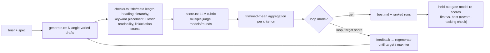

# seo-loop

SEO 콘텐츠(블로그 글/랜딩페이지 카피)를 **여러 버전 생성 → 결정론적 룰체크 → LLM 루브릭 채점 → 피드백 반영 재생성**하는 Rust CLI.
LLM 백엔드는 Claude Code CLI(`claude -p`) 서브프로세스. 별도 API 키 불필요.

[Loop-Suite/bizplan-loop](https://github.com/Loop-Suite/bizplan-loop)(사업계획서 생성 도구)와 같은
"N개 생성 → 룰체크 → de-anchoring 루브릭 채점 → 재생성" 아키텍처를 SEO 카피 생성에 이식한 프로젝트다.

## `seo-reference-library` 스킬과의 차이

이 CLI는 사용자가 이미 가진 `seo-reference-library` Claude Code 스킬과 **겹치지 않고 상호보완적**이다.
`seo-reference-library`는 **기존 사이트를 Evidence 기반으로 실측 감사(audit)**해 SEO 설계 패턴·체크리스트·점수로
정리하는 분석 도구다 — 이미 존재하는 페이지를 진단한다. 반면 `seo-loop`는 **새 콘텐츠를 생성**하고, 생성물을
룰체크·루브릭으로 채점해 목표 점수까지 자동으로 재생성하는 루프다 — 아직 없는 글을 만든다. 감사가 필요하면
`seo-reference-library`를, 새 블로그 글/랜딩페이지 카피 초안이 필요하면 `seo-loop`를 쓴다. `seo-reference-library`가
정리한 체크리스트를 `specs/*.toml`의 `guide`/`context`에 옮겨 채점 기준을 보강하는 식으로 함께 쓸 수 있다.

## Pipeline



## 요구사항

- Rust 1.70+
- `claude` CLI 설치 및 로그인 (PATH에 없으면 `--claude-bin`)

## 빌드

```bash
cargo build --release   # target/release/seo
```

## 3가지 모드

```bash
# 1) 초안 N개 생성 + 채점 + 랭킹
seo --model sonnet --judge-model haiku \
  gen --spec specs/example-blogpost.toml --brief brief.example.md -n 6 --rounds 2 --concurrency 3 --out runs/blog

# 2) 기존 글 채점만
seo --judge-model sonnet,haiku \
  score --spec specs/example-blogpost.toml --input 초안.md --rounds 3 --out runs/check

# 3) 목표 점수까지 자기개선 루프 (+ held-out 검증)
seo --model opus --judge-model sonnet --gate-model haiku \
  loop --spec specs/example-blogpost.toml --brief brief.example.md --target 85 --max-iter 4 --out runs/loop
```

## 백엔드 동작

호출은 항상 다음 형태다 (`claude --help` 실측 기준).

```
claude -p --output-format json --safe-mode --no-session-persistence --tools "" \
       [--model M] [--append-system-prompt S] [--json-schema SCHEMA] [--max-budget-usd X]
```

| 플래그 | 이유 |
|---|---|
| `--safe-mode` | 실행 디렉터리의 CLAUDE.md·스킬·플러그인·훅·MCP를 로드하지 않음 → 재현성 확보. `--load-context`로 해제 |
| `--tools ""` | 내장 도구(Read/Edit/Write/Bash) 전면 차단 → 순수 텍스트 생성, 파일 접근 없음 |
| `--no-session-persistence` | 세션 파일 미생성. 병렬 실행 시 경합 회피 |
| `--json-schema` | 채점 결과를 스키마로 강제. 검증된 객체가 응답의 `structured_output`으로 옴 |
| `--output-format json` | `result` / `structured_output` / `total_cost_usd` 수집. 누적 비용을 실행 끝에 출력 |

`--bare`는 쓰지 않는다. OAuth·키체인을 읽지 않고 `ANTHROPIC_API_KEY`만 허용하므로 구독 로그인 사용자의 인증이 깨진다.

프롬프트는 stdin으로 전달하고, stdin 쓰기와 stdout/stderr 읽기를 별도 스레드로 동시에 처리한다(파이프 버퍼 포화 교착 방지).

## 문서 포맷

생성/채점 대상 문서는 프론트매터 + 마크다운이다.

```markdown
---
title: "50~60자 사이 title"
meta_description: "120~160자 사이 meta description"
---

# H1 (정확히 1개)

본문... ## 소제목 ...
```

## 채점 방식

1. **결정론적 검사**(`checks.rs`, Rust, LLM 미사용):
   - title/meta_description 글자수 범위
   - H1 정확히 1개, 헤딩 레벨 건너뛰기 없음(H1→H3 등 금지)
   - 타깃 키워드가 title / H1 / 도입부 100자 각각에 **존재**하는지 (밀도%가 아니라 배치 여부만 본다 —
     키워드 밀도 기준은 SEO 업계에 공인된 컨센서스가 없어서 임의 % 기준을 강제하지 않는다)
   - 이미지 alt 텍스트 존재 여부
   - 내부링크 개수가 스펙에 정한 범위(기본 3~5개)인지 — **이 범위는 사이트 구조·글 길이에 따라 소스마다
     편차가 크다.** 절대 기준이 아니라 스펙 파일에서 사이트별로 조정해서 쓸 참고값이다.
   - 출처/인용(외부 권위 링크) 개수 — E-E-A-T용. `criteria`에 `citation_required = true`로 표시한
     항목은 인용이 `min_citations` 미만이면 **코드로 60점 상한**을 건다(아래 참고)
   - (보조 지표) Flesch Reading Ease / Flesch-Kincaid Grade — 영문 콘텐츠에서만 계산(아래 한계 참고)
2. **LLM 루브릭 채점**: 항목별 **0~100점**, 기본 4항목(가중치는 `specs/*.toml`에서 조정):
   - `search_intent_match` 0.30 — 검색 의도 부합도
   - `keyword_naturalness` 0.20 — 키워드 자연스러움(과최적화 방지)
   - `eeat_signals` 0.25 — 경험·전문성·권위성·신뢰성 신호, `citation_required = true`
   - `structure_readability` 0.25 — 헤딩 계층·문단 구조·스캔 가독성

   채점 전에 "이 검색 의도에서 상위 노출될 콘텐츠의 조건"을 먼저 쓰게 하고(de-anchoring),
   항목마다 **문서 원문 인용**과 **"왜 더 높은 점수가 아닌가"**를 강제한다. 근거 인용을 못 하면
   프롬프트 규칙상 60점 상한(내용 채점 전반에 대한 일반 규칙).
3. **인용 부족 60점 상한(코드 강제)**: `eeat_signals`처럼 `citation_required = true`인 항목은,
   출처/인용 링크 개수가 결정론적으로 세어지므로 — bizplan-loop처럼 LLM 프롬프트에만 맡기지 않고
   `score.rs`에서 실측 개수 기준으로 **직접 60점 상한을 건다**. 리포트에 🔒60 표시로 나타난다.
4. **집계**: `--rounds N` 회 채점 → 모델·관점 순환 → 항목별 **절사평균**(n≥4면 최소·최대 제외) → 가중 합산.
5. **불안정 지표**: 항목별 점수 산포(±)를 리포트에 표시. 산포가 크면 그 항목 판정은 신뢰하지 말 것.
6. **held-out 게이트**(`--gate-model`): 루프에 참여하지 않은 모델로 최초본·최고본만 재채점. 루프 점수는
   올랐는데 held-out 점수가 안 오르면 채점자 최적화(reward hacking)로 표시한다.

de-anchoring, 절사평균, held-out 게이트, 길이 canary, `--rounds`보다 `--judge-model` 패널을 권장하는 이유
등 설계 근거 원 출처(arXiv 논문 등)는 [bizplan-loop의 DESIGN.md](https://github.com/Loop-Suite/bizplan-loop/blob/main/DESIGN.md)를 참고.

## 오픈소스에서 가져온 것

- **[BlogPilot Open Source AI SEO Content Studio](https://github.com/IamRamgarhia/BlogPilot-Open-Source-AI-SEO-Content-Studio)**
  (MIT): `src/lib/seo/readability.ts`의 Flesch Reading Ease / Flesch-Kincaid Grade 계산 로직(마크다운
  스트리핑 → 문장/단어 분리 → 음절수 추정 → 표준 공식)을 Rust로 재작성해 `checks.rs`에 포팅했다. 코드
  복붙이 아니라 알고리즘 구조만 이식했다. 자세한 내용은 [NOTICE](NOTICE) 참고.
  같은 저장소의 E-E-A-T 체크리스트(`eeat-checklist.md`)는 코드가 아니라 방법론 문서라 아이디어 참고용으로만
  썼다(출처/인용 링크 검사, 루브릭 문구 설계에 반영).
  같은 저장소의 TF-IDF 키워드 추출(`tfidf.ts`)은 **포팅하지 않았다** — 경쟁사 상위 노출 문서 코퍼스가
  필요한 로직인데 본 CLI는 단일 문서 생성/채점 도구라 비교 코퍼스가 없다.
- `sour4bh/auto-seo`(라이선스 없음, 전체 권리 보유)는 코드를 전혀 참고하지 않았다. "룰+LLM 하이브리드
  채점"이라는 아이디어만(저작권 보호 대상 아님) 이 프로젝트의 결정론적 검사 + LLM 루브릭 구조를 설계할 때
  일반적인 참고가 됐다.
- Yoast SEO(wordpress-seo, GPL-2.0)는 소스를 읽지도 참고하지도 않았다. title/meta 글자수, H1 1개, 헤딩
  계층 등은 SEO 업계에 널리 알려진 일반 상식이므로 독자적으로 구현했다.

## 스펙 (`specs/*.toml`)

```toml
name = "블로그 글"
context = "사이트/브랜드/타깃 독자 맥락. 프롬프트에 그대로 삽입"
keyword = "타깃 키워드"
site_domain = "example.com"   # 내부/외부 링크 판정 기준

title_min = 50
title_max = 60
meta_min = 120
meta_max = 160
internal_links_min = 3
internal_links_max = 5
min_citations = 1

[[criteria]]
id = "eeat_signals"
name = "E-E-A-T 신호"
weight = 0.25
guide = "..."
citation_required = true   # 인용 부족 시 60점 상한
```

동봉 스펙: `specs/example-blogpost.toml`. 콘텐츠 브리프 예시: `brief.example.md`.

## 다각도 리뷰 반영 내역

review-panel(functionality/good_things/tests 렌즈) 결과 CONFIRMED된 항목을 반영했다:
- 프론트매터 파서가 CRLF 문서에서 줄마다 1바이트씩 과소 계산해 앞부분이 잘려나가던 버그를
  수정(`.lines()` 대신 `split('\n')` 기반 오프셋 계산으로 재작성).
- 닫는 `---`가 없는 프론트매터를 명시적으로 감지해 경고(이전엔 조용히 전체를 본문으로
  처리해 가독성·헤딩 검사가 오염됐음).
- `is_internal_url`이 부분 문자열 매칭이라 `notexample.com`/`example.com.evil.com` 같은
  호스트도 내부 링크로 오분류되던 문제를 정확한 호스트 비교로 수정.
- 문단 길이 검사 추가(CyberCraftBD/power-seo(MIT)의 아이디어를 한국어 글자수 기준으로
  재설계 — NOTICE 참고).
- CRLF·미닫힘 프론트매터·스푸핑 방지·한국어 가독성 None 분기·공백뿐인 alt 등 테스트 커버리지 보강.

## 한계 · 가정

- **키워드 밀도는 검사하지 않는다.** 배치 존재 여부(title/H1/도입부)만 본다 — 밀도 %는 업계 컨센서스가
  없어서 임의 기준을 강제하면 오히려 잘못된 최적화를 유도할 수 있다.
- **내부링크 3~5개 범위는 소스마다 편차가 크다.** 스펙 파일의 `internal_links_min/max`로 사이트별 조정 필요.
- **Flesch 가독성 지표는 영문 콘텐츠 전용이다.** Flesch 공식은 영문 음절수 기반이라 한국어 등
  비라틴 문자 콘텐츠에는 성립하지 않는다. 본문의 라틴 문자 비중이 50% 미만이면 자동으로 계산을 건너뛰고
  리포트에 N/A로 표시한다(임의 판단 — 다른 임계값도 가능하나 보수적으로 50%로 설정).
- 내부링크/출처링크 판정은 `site_domain` 문자열 포함 여부로만 판단하는 단순 휴리스틱이다.
  서브도메인·단축 URL 등은 오탐 가능성이 있다.
- LLM 점수는 실제 검색 순위나 클릭률을 보장하지 않는다. 같은 스펙·같은 채점 모델 안에서의
  **상대 비교**와 **개선 방향 도출**용.
- 생성 모델과 채점 모델이 같으면 자기 문체를 후하게 본다(`--judge-model` 미지정 시 경고 출력).
- `claude -p`는 temperature를 노출하지 않는다 → 초안 다양성은 angle 프롬프트로만 만든다.
- 출력은 마크다운(프론트매터 포함). CMS별 실제 발행 포맷 변환은 범위 밖.
